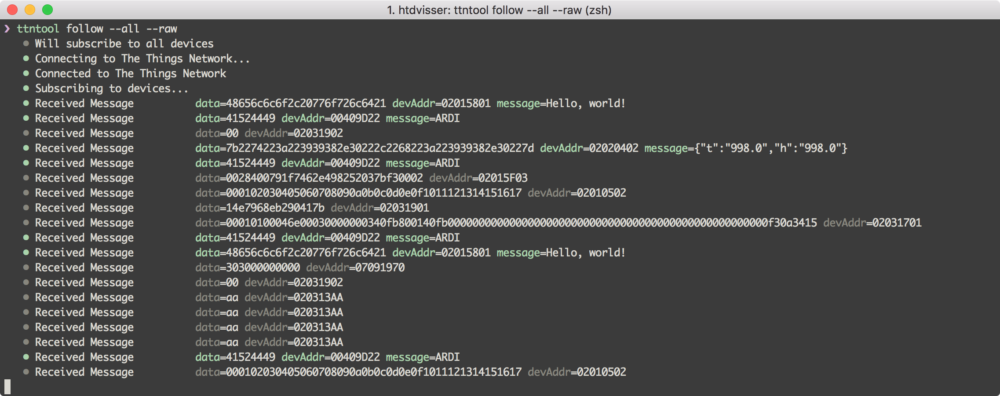

# The Things Network Toolbox

This will be a collection of tools that help you interact with The Things Network.



## Installation

```
go get github.com/htdvisser/ttntool
```

Or download a [binary release](https://github.com/htdvisser/ttntool/releases).

## Configuration Flags

```
--appSKey string   App Session key (optional)
--broker  string   Broker address (optional)
--nwkSKey string   Network Session key (optional)
```

## Follow Command

```
Connects to The Things Network and prints out messages received from the specified devices.

Usage:
  ttntool follow devAddr [devAddr [...]] [flags]

Flags:
  --all              Follow all devices
  --gateway string   Filter for one gateway
  --meta             Show metadata
  --raw              Show raw data
```
